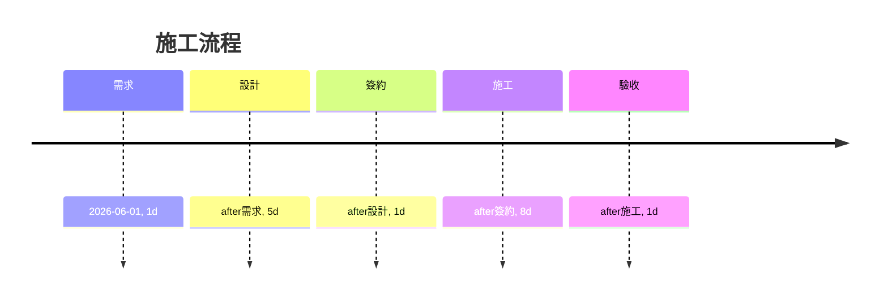

# One Room 報價大腦 V1

**執行摘要：** 本報告整合先前對話與業界資料，針對 One Room 輕裝修服務之報價邏輯與策略進行系統化歸納。內容涵蓋：報價項目拆解（設計費、家具、燈具、地板、窗簾、水電拉線、搬運上樓、組裝、清運、監工、人工等），各項費用依據及常見變動因子；客戶類型與常見疑慮分析；不同預算區間（≤設計費、10萬、15萬、16萬、17萬）的報價策略與話術範本；適合與不適合承接的案子與風險；可直接套用的報價範本與三種案例；員工手冊要點（SOP、簽約流程、工期、選料流程等）；談判策略與對話文案；AI 自動估價規則草案。以下為詳細說明，並提供摘要表格與流程圖（**需求→設計→簽約→施工→驗收**）以供快速參考。

## 1. 完整的估價項目與依據

One Room 屬於**輕裝修/美觀改造**服務，報價項目主要包括下列分類，並參考常見市場價格範圍：  

- **設計費**：產生設計圖、平面配置與風格建議等。【3†L99-L108】一般室內設計費依坪數計算，每坪約NT$3,000～12,000不等（視設計複雜度與團隊規模而異）【3†L99-L108】。One Room 目前常用約NT$5,800作為一套基礎平面與效果圖的設計費，設計費用含初步丈量與平面規劃，但實際施工前可再依需求修正。  
- **家具與系統櫃**：包括系統收納櫃、展示櫃、電視櫃、升降桌、懶人區傢俱等。系統傢俱通常按**尺數**計價，每尺板材價格約NT$3,500～8,000【8†L119-L121】；例如一個5呎（約15尺）的訂製衣櫃含板材與五金成本約NT$17,500～40,000。中高階材質與複雜收納設計會提高成本。客戶選擇的配置等級越高（如鋼琴烤漆、特殊板材），價格差距可達二倍以上。  
- **燈具與電氣**：包含主燈、氛圍燈、射燈、燈槽拉線等。一般照明燈具（如LED吸頂燈、筒燈）單價從NT$1,000到數千元不等，而氛圍燈串、燈槽線條等材料也需額外計價。水電施工部分若需新拉線、暗挖管線或增加回路，約按工作量計價（如每回路NT$1,000上下，人力若需開孔重新拉線工資約NT$2,000~4,000/次）。  
- **地坪**：若需更換地板，一般採用**超耐磨木地板**或石塑地板。超耐磨木地板行情約NT$4,000～8,000/坪【22†L96-L100】；石塑（SPC）地板約NT$1,500～5,000/坪【22†L114-L119】。此外需另計基礎處理、黏貼與工班人工費（可估約NT$500～1,000/坪）。舊地板拆除或地板修補也可能增加費用。  
- **窗簾**：視窗戶大小與樣式計價。例如捲簾按「才」計算，一般單價約NT$150～700/才【20†L60-L68】，一個約20才的窗戶（約2.4m×2.4m）若用基本款捲簾約NT$3,000～8,000【20†L60-L68】；特殊斑馬簾、遮光布簾等會更高。布簾（以米/尺計價）與軌道安裝費也需包含在內。  
- **水電拉線**：若新增燈具或插座，須扣電線管路。一般計價可參考每米電線和配管費用（例如每米NT$50～100）以及每個電箱或插座開孔接線工資（約NT$1,000~2,000/處）。如果已有路徑，只是新增輕型燈具，成本較低。  
- **搬運/吊裝/清運**：大型家具、板材等需搬運到施工現場。台灣搬家公司資料顯示，搬運約10坪套房一次費用約NT$2,800～6,000【25†L30-L33】（兩地有電梯、同縣市），若爬樓梯則另外加價【25†L109-L117】（例如1樓→5樓約NT$2,900；5樓→5樓約NT$3,300【25†L109-L117】）。One Room 通常包辦舊傢俱拆除與廢棄清運，此部分工資也需考慮。  
- **組裝與監工**：系統櫃、衣櫥、展示櫃等都需現場組裝定位，涉及木工與五金安裝工資（可估每件NT$1,000～3,000或時薪計算）。監工或設計師到場協調與驗收，也是工時成本的一部分。  
- **人工工時與雜料**：施工期間人力成本較高，包括泥作、油漆、水電、木工等師傅工資。台灣室內裝修工時費每日約NT$4,000～5,000不等【30†L85-L93】。One Room 案件多為短期工期，人力成本需視實際工日和人數而定，通常會內含於總報價。雜料（螺絲、管管頭、油漆等）則按實際用量算，比例較低。  

以上各項整體估價常以「面積×單價＋固定項目」方式疊算，並視客戶需求增減。例如系統櫃櫃體每尺數量乘以單價，再加上搬運與組裝費；燈具及水電以件數計價；設計費與監工則是固定項目。報價初步採中高等級材料與配置估算，之後可視客戶意願做調整。

## 2. 客戶類型與常見疑慮

根據對話紀錄與實務經驗，One Room 服務的客戶類型大致可分為：  

- **預算敏感型**：這類客戶目標明確，希望在既定預算內獲得最佳效果，常會在最後階段請求進一步壓價。例如從16.5萬元壓到15.5萬元，或者要求免費加項。他們不一定對裝修了解很多，主要關心「最後到底要付多少」。處理策略是詳細說明升級需求的成本差異，並強調前期溝通方案已經最緊湊；同時可提出替代方案，讓客戶自行衡量哪些項目可優先或捨棄。  
- **未選料/流程不熟型**：這類客戶對裝修流程不了解，尚未選擇具體材質，往往擔心報價不透明或未來無法更改。例如詢問「還沒選材料，要怎麼報價？」之類問題。應回答：目前報價以**中高階材質等級**估算，讓客戶知道預算是在合理範圍內；簽約前一定提供實際選料與款式供挑選，不會強制配置。如此可降低客戶對「被綁死」的擔憂。  
- **小空間/簡單需求型**：如只需要做局部改造的單室客戶，預算通常較低（約10萬元以下）。他們可能期望簡單更新而不做大動干戈。報價時可強調服務為**「輕裝修＋軟裝搭配」**，突出效果改造而非重裝，避免誤以為是傳統裝潢套餐。對話中可引導他們先看設計效果圖，再決定是否執行，以確保期望對齊。  
- **品質導向/大改造型**：空間坪數較大（7~8坪或多空間合併），且重視整體動線與氛圍布置的客戶。這類客戶預算通常較充裕，但對品質和格局要求高。對話策略可以強調設計和執行的專業性，並在拆解報價時突出每個項目的價值（例如說明大型訂製櫃的整體成本，不只是櫃體本身，也包含運輸與組裝難度）。對他們可使用較為細膩的溝通，保持專業和耐心。  

常見疑慮總結：**預算壓低**、**未選料擔心附加費**、**工期及流程不清楚**。以上類型多重疊，談判時可依對象有的放矢。例如預算壓低者重申成本（見下節策略）；不知流程者就講清設計→簽約→施工的步驟（見員工手冊）。

## 3. 各預算區間報價策略與話術範本

針對不同預算需求，報價策略及溝通口吻宜有所區別。以下按預算分類，並提供每種情境下的**兩段式 Line 回覆範例**：  

- **設計單項（≤6千）**：僅需要初步設計方案，不含施工。此時應聚焦「設計產出」價值，避免落實施工範圍。範例：  
  1. **第一段**：感謝關注 One Room，解釋「設計費」意義，例如「我們提供單次 NT$5,800 的完整空間規劃圖，包含平面配置與風格建議。設計圖階段的成果可讓您在施工前先了解整體方向。」  
  2. **第二段**：明確指出設計服務與後續施工分開計價，「若後續需要施工，我們再據此做施工報價；若只需設計部分，支付設計費即可。」並可附加「目前報價不含施工費用，僅提供規劃與建議」。

- **小型空間（約10萬）**：適用1間小臥室或單項小改造。報價時強調**精簡配置**、**核心功能**。溝通時可分兩段：  
  1. **第一段**：列出主要可做項目，如簡易地板更新、局部燈光和收納優化，示範大致項目。  
  2. **第二段**：說明總預算控制點，例如「10萬我們將會主推您最需要的改造部分，其他可視情況調整」，並告知後續可依實際需求微調，表達彈性。  
  *範例分段：*  
  > **範例（10萬案）**  
  > 「您好，這個預算約在*臥室單間*的改造等級。我們可以將**重點放在地板更新、新增一些收納與燈光氛圍**上，讓空間質感立即提升。大致包含鋪設木地板、裝新窗簾、換一些LED燈具及更換局部家具。」  
  > 「考量您的預算，我們會先做**最關鍵的項目**，確保效果；若後續還有彈性空間，可再增加（或減少）無關痛癢的小項目。目前報價為中高等級配置估算，設計圖完成後再提供詳細品項報價與選料，不會強制用固定款。」  

- **中型空間（約15萬）**：通常是單間7-8坪大臥室或小客廳。項目包含較多，如**訂製衣櫃、升降桌、電視櫃、氛圍燈**等。對話分段示例：  
  1. **第一段**：概述可做改造範圍（參照對話中的列表），強調「空間一次到位重整」。  
  2. **第二段**：報價總額（如約17萬）較高時，可先提「預估約17萬元」，再表示了解客戶希望15萬左右，說明已盡量緊縮成本，如「盡量壓到16萬」。可以提出讓步（例如略調降配置等），或示意「我們願意替您優化方案，保留主要效果」。  
  *範例：*  
  > **範例（15萬案）**  
  > 「您好！這次**客廳＋電腦房**會一起規劃，重點是燈光、動線與收納一次搞定。我們會替您換掉**整組電視櫃、升降桌、系統櫃、窗簾地板**等（除沙發外幾乎重做），並增設燈槽、軌道燈等氛圍燈配置。改造後空間會更好收納、好生活，效果會大幅提升。」  
  > 「整體評估下來，這樣的內容約**17萬元**左右。我知道您希望控制在15萬，但15萬很難做完這麼多項目，我們只能先試著幫您**壓到16萬元**。目前是以中高配置估算，還沒算選料實價。如果非得15萬以內，我們可以討論調整哪些內容、材質，盡量保留核心效果。」

- **大型空間（約16~17萬）**：如上例的重度整合案，或多空間（如客廳+電腦房）。策略類似中型案，但更強調整體動線與氛圍布置的價值。如客戶堅持15萬以下，可使用同樣兩段式溝通：  
  1. **第一段**：重點項目與增值點介紹。  
  2. **第二段**：強調「16萬已是最緊綁的報價」，並可以提出小額讓步（如提供免費清運、支援部分水電費用），展現誠意。  

- **超大型或跨空間案（>17萬）**：若預算更高或客戶需求範圍更大，可根據具體狀況拆分階段報價。策略偏向強調專業與全案規劃，並注意避免一口價陷阱。此處不詳列，但原則是參考上述模式。

**每種預算**的 Line 文字範本著重點在：先列出可提供的服務項目與效果，再說明預算與選項彈性。第一段務實描述內容；第二段說明金額與調整空間。

## 4. 適合/不適合承接案型與風險提示

**值得承接的案子**：One Room 適合**中小坪數、重點突出**的裝修改造，例如：換地板、重做收納櫃、燈光升級的小型住宅；或像範例中所示的7-8坪大房間和加一房共同設計的案子。客戶有一定設計需求但預算有限，不需要做天花、拆牆等大規模基礎工程，可一次解決多種問題。

**不建議接的案子**：如果**預算過低**且需求過多（例如15萬預算要做10幾個項目，或客戶始終不肯妥協）風險較高；或者**範圍太大**（如整棟裝修、結構重做、水電大改）就超出 One Room 輕改造範疇了。此外，客戶如果態度過於刁鑽、無理壓價，也屬可考慮拒案的因素。

**風險提示**：  
- **預算落差**：案件評估時務必確認範圍，避免埋單。例如客戶一開始想小改，但後續要求擴大範圍，需明確二次報價重新簽約。  
- **工期與住家干擾**：One Room 工期雖短，但在現場施工時還是會產生噪音或暫時搬動。進場前應確認客戶可以暫歇區或安排好生活配合。  
- **溝通落差**：因為對話非面談，容易資訊有誤差。每次報價和方案應有書面或圖面佐證，避免口頭約定爭議。  
- **物料漲價**：施工時間拖延或外部因素也可能導致報價偏差。建議合約中備註如有重大漲價，需追加協商。

## 5. 報價範本表格與案例

### 報價範本表格（可直接套用）  

| 項目            | 說明                         | 估價範圍（含施工）      | 備註                                       |
|:---------------|:----------------------------|:-------------------|:-----------------------------------------|
| 設計圖/設計費   | 提供完整平面配置與風格建議       | 約NT$5,000～6,000（固定一次付） | 依坪數或案型增減；One Room常用NT$5,800             |
| 地坪（木地板）  | 超耐磨木地板含施工            | 約NT$4,000～8,000/坪【22†L96-L100】 | 包含地板材料與鋪裝；拆除舊地板另計               |
| 窗簾           | 捲簾/布簾含軌道安裝           | 約NT$150～700/才【20†L60-L68】   | 計價單位「才」（30cm×30cm）；也可報單窗總價        |
| 照明/燈具       | LED主燈、氛圍燈含安裝         | 每盞約NT$1,000～5,000+  | 含燈具本體，安裝工資另計；氛圍燈如燈槽線依長度計價     |
| 訂製傢俱/系統櫃 | 衣櫃、電視櫃、書櫃等           | 約NT$3,500～8,000/尺【8†L119-L121】 | 含板材、五金；組裝工資另計；升降桌等特殊品項另報       |
| 水電拉線       | 新增燈座、插座、開關等         | 每處約NT$1,000～2,000+   | 依實際管路長度計算管材和工資；短線在方案內吸收       |
| 搬運/上樓       | 傢俱、板材等吊運搬運          | 約NT$2,800～6,000/車【25†L30-L33】 | 含同縣市搬運費；跨樓層另加約NT$300～500/層【25†L109-L117】 |
| 組裝/清運       | 木工組裝、家具定位、舊傢俱清運   | 每件NT$1,000～3,000    | 系統櫃等大型品項組裝工資；清運按件計或協商          |
| 人工監工       | 工班人工、設計師監造等        | 依天數、人數計算        | 一般7～10天；含各工種工資，通常內含於總價；            |
| **合計**       |                              | 按項目累計合計           | 先估總價後分項詳報；所有價格為預估、簽約後按實際調整     |

以上表格為典型項目範例，實際報價時可勾選適用項目並填上具體單價與數量。

### 3 個實例報價範本

以下提供**小案、中案、大案**（含大致項目和總價）舉例：  

1. **小案（例：4坪臥室）** – 預算約NT$30,000左右  
   | 項目   | 說明               | 單價/數量   | 金額範圍   | 備註                 |
   |:------|:------------------|:---------|:-------|:--------------------|
   | 設計圖  | 一次平面+風格圖         | $5,800×1  | $5,800  | 固定設計費             |
   | 地板   | 超耐磨木地板鋪設        | ~$6,000×1 | $6,000  | 1.5坪×$4,000/坪          |
   | 窗簾   | 一般捲簾含安裝         | ~$5,000×1 | $5,000  | 約20才窗戶            |
   | 照明   | LED吸頂燈更換1盞       | ~$1,500×1 | $1,500  |                    |
   | 小型傢具 | 床頭櫃、衣架等          | ~$5,000    | $5,000  | 選購或網購             |
   | 搬運+組裝 | 家俱搬運+基本組裝       | $3,000    | $3,000  | 包含舊傢俱清運          |
   | 其他    | 小修 + 雜料           | $2,000    | $2,000  | 油漆、螺絲等小配件成本     |
   | **合計** |                    |           | **$28,300** | (含設計費)             |

2. **中案（例：7坪臥房）** – 預算約NT$120,000左右  
   | 項目       | 說明                     | 單價/數量      | 金額範圍     | 備註                 |
   |:----------|:------------------------|:-------------|:---------|:--------------------|
   | 設計圖      | 平面圖+3D風格建議            | $5,800×1      | $5,800    |                    |
   | 地板       | 超耐磨木地板            | ~$5,000×3    | $15,000   | 3坪×$5,000/坪          |
   | 窗簾       | 遮光窗簾含軌道安裝         | ~$7,000×1    | $7,000    | 大型窗戶             |
   | 系統衣櫃    | 5尺訂製衣櫃            | $17,500×1    | $17,500   | 含板材、把手、組裝       |
   | 電視櫃      | 客製電視/展示櫃         | $10,000×1    | $10,000   | 約寬2米，木心板製        |
   | 升降桌+椅   | 多功能電腦升降桌椅套件      | $8,000×1     | $8,000    |                    |
   | 氛圍燈      | LED 燈帶+軌道燈          | $5,000×1     | $5,000    | 造型天花燈條           |
   | 燈具+配線   | 主燈+新增插座         | $3,000×1     | $3,000    |                    |
   | 搬運+組裝   | 家具搬運至現場+組裝       | $4,000      | $4,000    |                    |
   | 清運       | 舊傢俱拆除+處理          | $3,000      | $3,000    |                    |
   | 人工       | 各工種人工約7天          | $40,000      | $40,000   | 含泥作、木工、水電費     |
   | **合計**   |                        |              | **$118,300**| 含設計費             |

3. **大案（例：客廳+電腦房共2空間，約15坪）** – 預算約NT$170,000左右  
   | 項目        | 說明                         | 單價/數量        | 金額範圍     | 備註                    |
   |:-----------|:----------------------------|:---------------|:---------|:-----------------------|
   | 設計圖       | 雙空間平面+氛圍圖                | $5,800×1         | $5,800    |                        |
   | 地板        | 超耐磨木地板                  | ~$6,000×5       | $30,000   | 5坪×$6,000/坪            |
   | 窗簾        | 雙客廳窗簾（遮光+紗簾）         | $12,000×1       | $12,000   | 大面寬整組              |
   | 客製展示櫃    | 客廳、書房展示/收納櫃            | $25,000×1       | $25,000   | 包含客廳牆面展示櫃        |
   | 系統電視櫃    | 客廳電視牆櫃                  | $12,000×1       | $12,000   |                        |
   | 系統衣櫃/吊衣區 | 開放式衣帽間收納                | $15,000×1       | $15,000   |                        |
   | 升降桌       | 電腦升降桌椅                  | $8,000×1        | $8,000    |                        |
   | 燈具與配線    | 客廳+書房多燈具（LED 吸頂燈+燈槽+射燈） | $20,000×1       | $20,000   | 大量燈具與暗架            |
   | 水電        | 新增插座/照明線路                | $5,000×1        | $5,000    |                        |
   | 搬運/組裝    | 大件傢俱搬運+全套組裝            | $8,000×1        | $8,000    |                        |
   | 清運        | 舊傢俱+廢料處理                 | $5,000×1        | $5,000    |                        |
   | 人工        | 約10天各工種人工                | $40,000         | $40,000   | 含監工、工人費用          |
   | **合計**    |                            |                | **$170,800**| 含設計費               |

以上範例僅供參考，實際報價仍須依現場丈量與客戶最終選料而調整。

## 6. 員工使用手冊要點

- **需求分析**：首次與客戶溝通時，確認**空間坪數、使用需求與預算範圍**。主動詢問「大概希望投入多少預算做哪些項目」，避免報價後客戶喊貴。  
- **丈量與設計**：同意後收取設計費後，安排丈量，畫出平面圖與效果圖。說明設計成果包含施工圖與主材規劃，讓客戶明白價值。  
- **報價與簽約**：依據設計內容拆分報價項目，呈現報價單表格。與客戶逐項說明如上所述的項目及費用範圍，確定無誤後簽署合約。常用合約期為一個月，以便包括設計、備料與施工，但實際現場施工約7~10天。  
- **預付款項**：簽約時通常先收取**30%訂金**，其餘在完工前付清。所有付款進度及條件應寫入合約。  
- **選料流程**：在簽約後立即安排選料。提供板材、布料、燈具等樣品讓客戶挑選，並標註每種材料對應的價格範疇。確認後簽署材料單，以免後續變更糾紛。  
- **施工安排**：安排工班進場前，提醒客戶暫時清空施工區域（如搬離貴重物品）。施工期間可間斷施工，客戶可留宿家中。每日工作結束後保持清潔。  
- **驗收交屋**：工期結束後與客戶一同檢查。若有瑕疵或不足（例如木作不平、油漆掉漆），需在交屋前修補完成。完成後開立正式完工通知，並結清尾款。

- **合約期與施工時間**：合約可短約一至兩個月，以涵蓋全程，實際工期約1～2週。口頭告知客戶「我們簽約壓一個月，但其間會預留材料採購和彈性時間，實際施工可在7~10天內完成」可降低客戶顧慮。  
- **客戶溝通**：保持透明。若有任何變更（如客戶額外需求、材料漲價），應立即說明是否影響原報價，並提供替代方案。報價階段盡量完整，不留後續加價陷阱。

此手冊要點便於新進人員快速掌握 One Room 案件流程與注意事項，也可作為銷售與設計同仁訓練指南。

## 7. 建議談判策略與範例話術

針對客戶壓價時，可採取不同策略：

- **保守型（堅持價值）**：重點說明成本差距與價值，語氣較為堅定。  
  - *第一段*：強調新需求增加的工作與成本，例如「升級到5呎大型衣櫃，不只是櫃體更大，也要更多人力搬運、上樓、組裝，成本差距很大。這部分真的沒法跟原本4呎櫃比。現在報價已經是盡量壓低的價格。」  
  - *第二段*：解釋中高階配置預估與後續流程，如「我們現在的報價是以**中高規配置**估算的，方便先確認總預算可行。若後續您決定做，就會提供多種實際材質供選擇，我們不會強制固定材質。整體效果和預算都盡量做到平衡。」

- **讓步型（表達誠意）**：先認同客戶需求，然後提出實際讓步，如免費項目或調整。  
  - *第一段*：表達理解客戶考量，如「了解您想壓低預算的心情，我們也盡量幫您控制。其實設計師已經幫您把整體方案壓到**16萬元**左右，連燈具部分也願意吸收部分水電費用，算是我們對您的誠意。」  
  - *第二段*：提出具體福利或替代方案，如「另外，您原本的舊衣櫃我們可以免費清運掉，省掉請其他人清運的費用。如果15萬元內真的有困難，我們可以再討論哪些項目調整、材質換成次級；但16萬元是我們目前能壓到的底線。」

以上兩種風格話術需搭配客戶個性選用：對方若較強勢可用「保守型」強調理由；若希望維繫好感或降低客戶抗拒則用「讓步型」示誠意。對話時務必禮貌堅實，避免口頭承諾超出底線。

## 8. AI 自動估價規則草案

可考慮將報價流程自動化，根據條件加權計算估價。建議規則示例：  

- **面積與空間數**：每坪基礎價格。例如：小空間（≤5坪）基本工項一次加總為NT$60,000；中空間（5-10坪）以基準坪數（如7坪）×NT$10,000/坪；超過10坪以×NT$12,000/坪開始計算。空間數增加（如客廳+房）加倍基礎費用。  
- **設計費**：必填單次固定NT$5,800，如果客戶只要設計圖則直接輸出NT$5,800。  
- **訂製家具**：若包含系統櫃（依尺數輸入），則系統套件費用自動計入（每尺約NT$3,500～8,000乘以長寬單位）；升降桌、電視櫃、懶人沙發等特殊傢俱可預設單價乘數。  
- **燈具數量**：根據報價中燈具件數與類型計算（如每盞基本燈NT$1,500，氛圍燈額外X NT$500/米線），自動加總。  
- **地坪更新**：若選擇地板更新功能，依更新坪數×NT$4,000～6,000/坪範圍估算。自動加入鋪設費用。  
- **窗簾及配件**：輸入窗戶「才數」或平米面積，自動計算捲簾/布簾基本費用。  
- **搬運樓層**：輸入搬運樓層（含電梯標註「Y/N」），若需爬樓梯則根據樓層額外加NT$300～500/樓層【25†L109-L117】。  
- **含施工人工**：根據上面項目初步估價後，附加固定比例（如15-20%）作為人工與監工費。  
- **額外選項**：如「是否含全屋清運」或「是否需加油漆處理」，勾選後可加固定費用（如NT$3,000-5,000）。  

各項權重可依歷史案件調整，例如「訂製家具比例高則實際增加成本多，可在總額加成5%」，或「集客區（客廳）施工複雜度高，面積比一般房間加價10%」。此自動規則可作為快速報價參考，最終仍需人工確認細節。

## 9. 參考來源

本報告主要萃取自對話內容與 One Room 內部資料，並參考下列業界數據：室內設計費行情【3†L99-L108】、系統櫃單價【8†L119-L121】、窗簾價格【20†L60-L68】、木地板價格【22†L96-L100】、搬家費用【25†L30-L33】【25†L109-L117】等，以確保估價範疇與落在合理區間。所有報價範本及數字為概估值，實際執行時需依現場狀況再作調整。

---

**快速檢核表（銷售人員使用）：**  
- 確認客戶**需求與預算**，是否符合 One Room 定位；  
- 建議**先畫設計圖**（費用約NT$5,800）以對齊方向；  
- 拆解報價項目，清楚解釋每項費用來源；  
- 說明簽約後的**選料與付款流程**；  
- 提前告知**工期**（約7-10天可完工）與可住院說明；  
- 面對壓價時，依「保守型／讓步型」策略應對；  
- 若客戶需求過大或預算不足，及早提供替代方案或婉拒建議。